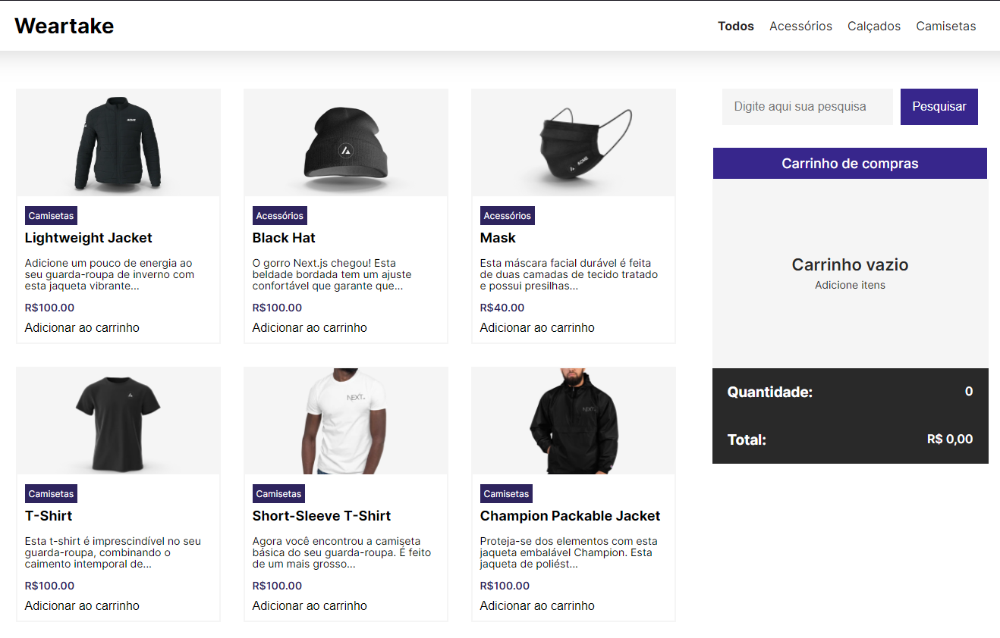
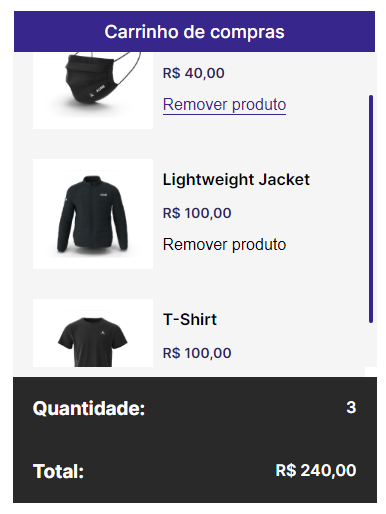
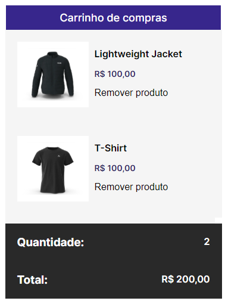

# Weartake

## Weartake / isgabriel

  
Weartake é um e-commerce de vestiário. O usuário que acessar o site conseguirá visualizar os produtos disponíveis para venda e seu carrinho de compras, que se inicia vazio mas vai crescendo à medida que itens serão adicionados. Existe, em cada item do carrinho, um botão para remover item. A barra de pesquisa e as seções são apenas para fins de ilustração. É feito um cálculo do valor total de acordo com os itens que são adicionados/removidos do carrinho e esse valor é atualizado a cada alteração.

  
  ## Tecnologias
  
Aqui estão as tecnologias usadas no projeto:

  
  - HTML semântico
  - CSS
  - Javascript (DOM)
  
   ## Serviço usado
   - Github
 
 ## Como usar
  
 <h3>1 - AO entrar no site do e-commerce, esta é a página carregada</h3>
 
 
 <h3>2 - Os card possuem um efeito ao passar o cursou por cima</h3>
 

 <h3>3 - O carrinho de itens ao adicionar mais de 2 itens terá um scroll!</h3>
 

 <h3>4 - O carrinho ao remover um item terá seu valor total atualizado</h3>
 

## Funcionalidades

-   Adicionar itens ao clicar no botão "Adicionar ao carrinho";
-   Remover itens do carrinho ao clicar no botão "remover";
-   Cálculo da quantidade total de itens no carrinho;
-   Cálculo do valor total dos produtos no carrinho.

## Links

-   Deploy: https://weartake-delta.vercel.app
-   Repository: https://github.com/isgabriel/Weartake

## Futuras implementações

-   Filtrar itens ao clicar nas seções do header;
-   Tornar todo o projeto responsivo para todos os tamanhos de tela;
-   Limitar para apenas um item de cada da lista no carrinho e ter a quantidade de itens do mesmo tipo dentro do card de cada item;
-   Botão para adicionar e diminuir a quantidade de itens de cada item dentro do carrinho.

## Autores

<table>
  <tr>
    <td align="center">
      <a href="http://github.com/isgabriel">
         
        
          <b>isgabriel</b>
        
      </a>
    </td>
  </tr>
</table>
